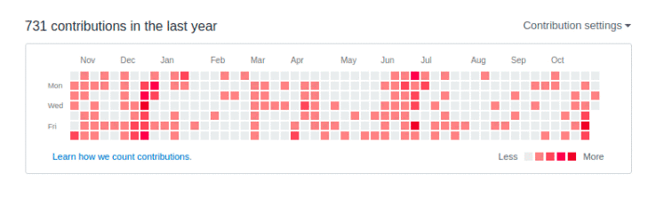

# Beautiful GitHub

Web Extension: Beautiful new colors for GitHub contributions graph picked randomly each time you open a GitHub profile.

The above GIF depicts different colors available in the extension.

## Getting Started

Install the extension from [Chrome Store](https://chrome.google.com/webstore/detail/beautiful-github/dhbppboodcppiohhdjgdldpeemcfheen).

You also install it on [Firefox](https://addons.mozilla.org/en-US/firefox/addon/beautiful-github/).

## Contributing

- Clone the repository to your system or download it as [.zip](https://github.com/vatz88/Beautiful-GitHub/zipball/master) or [.tar.gz](https://github.com/vatz88/Beautiful-GitHub/tarball/master). The `src` folder has the extension code. Follow this [guide](https://developer.chrome.com/extensions/getstarted#unpacked) to load extension in developer mode in Chrome browser.

- Have a new idea or found a bug? Feel free to open [issues](https://github.com/vatz88/Beautiful-GitHub/issues).

## Authors

- **Vatsal Joshi** - *Initial work* - [vatz88](https://github.com/vatz88)

<!--
See also the list of [contributors](https://github.com/VaTz88/FFCSonTheGo/contributors) who participated in this project.
-->

## License

This project is licensed under the MIT License - see the [LICENSE](LICENSE) file for details.

## Acknowledgments

Colors are choosen from [material design style color](https://material.io/guidelines/style/color.html#color-color-palette).
